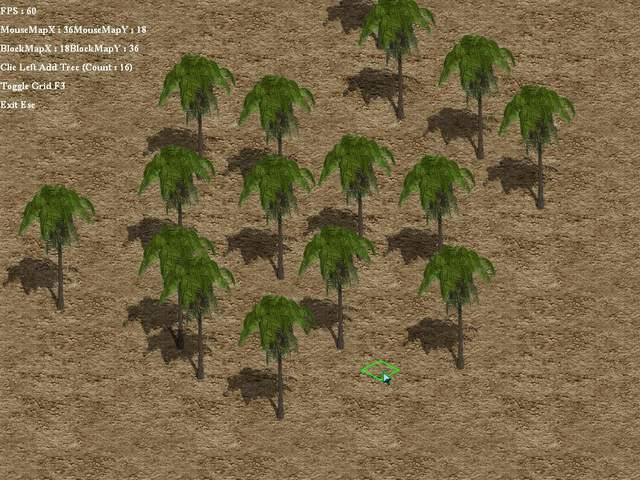



## Isometric Game Editor Cool\!\!\!

### Description

It's cool Isometric simple for beginner.I use Dabooda Turbo 2D Engine.
 
### More Info
 

             |
---                |---
**Submitted On**   |2005-06-24 23:49:22
**By**             |[Luis Barros](https://github.com/Planet-Source-Code/PSCIndex/blob/master/ByAuthor/luis-barros.md)
**Level**          |Advanced
**User Rating**    |5.0 (25 globes from 5 users)
**Compatibility**  |VB 6\.0
**Category**       |[Games](https://github.com/Planet-Source-Code/PSCIndex/blob/master/ByCategory/games__1-38.md)
**World**          |[Visual Basic](https://github.com/Planet-Source-Code/PSCIndex/blob/master/ByWorld/visual-basic.md)
**Archive File**   |[Isometric\_1905466242005\.zip](https://github.com/Planet-Source-Code/luis-barros-isometric-game-editor-cool__1-61329/archive/master.zip)

